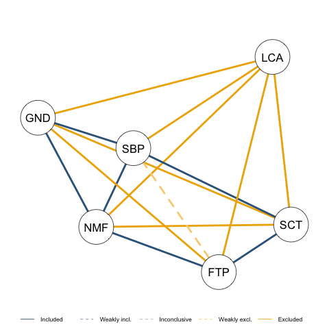
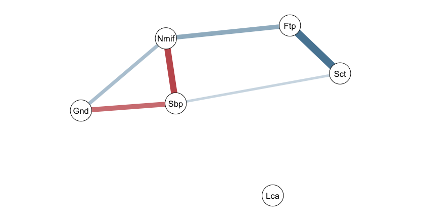
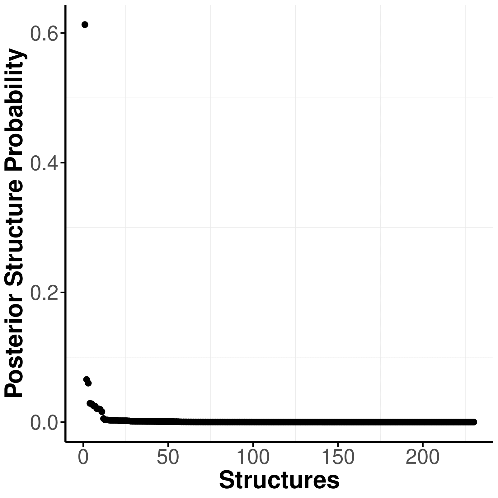
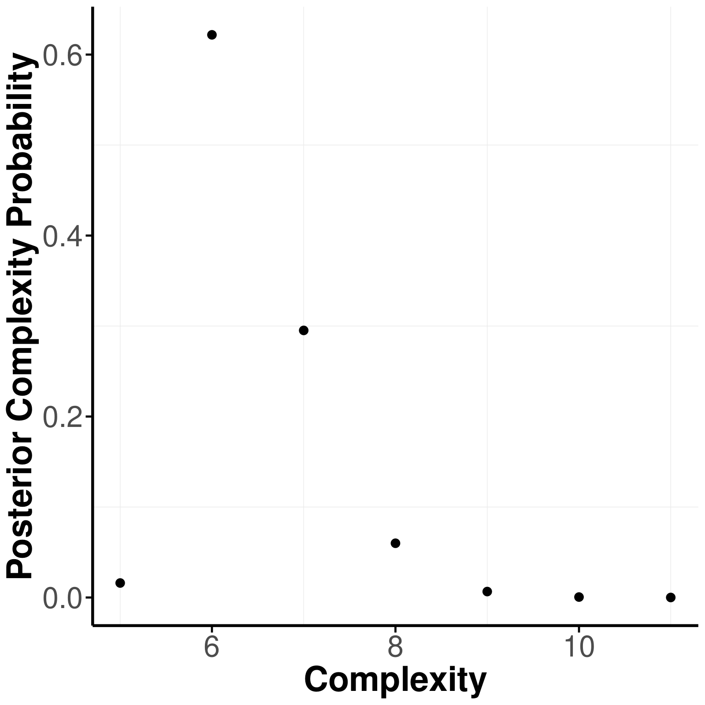
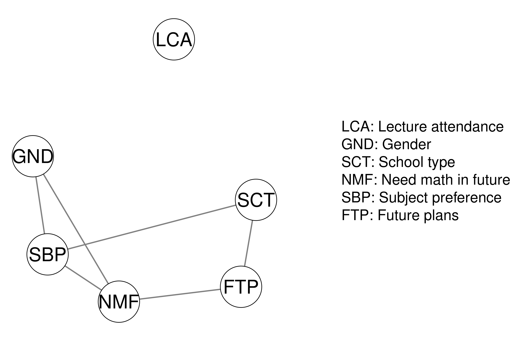
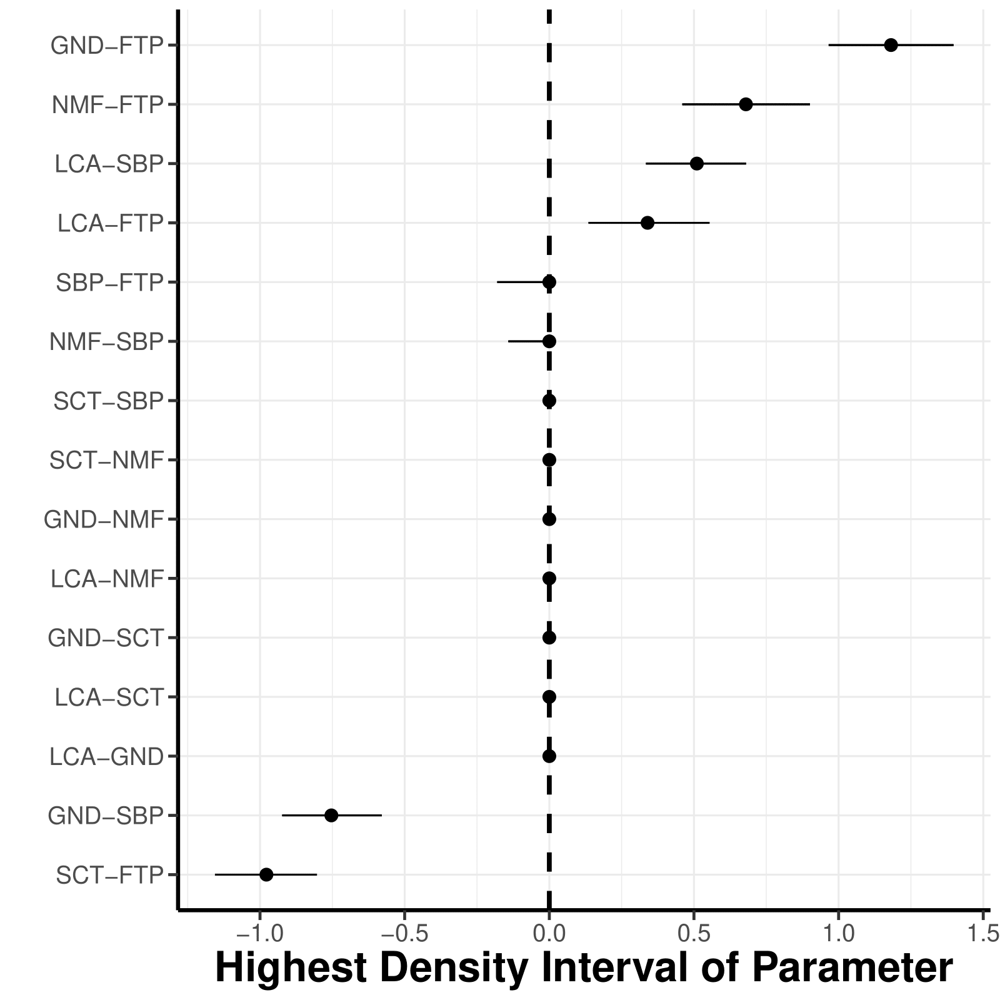
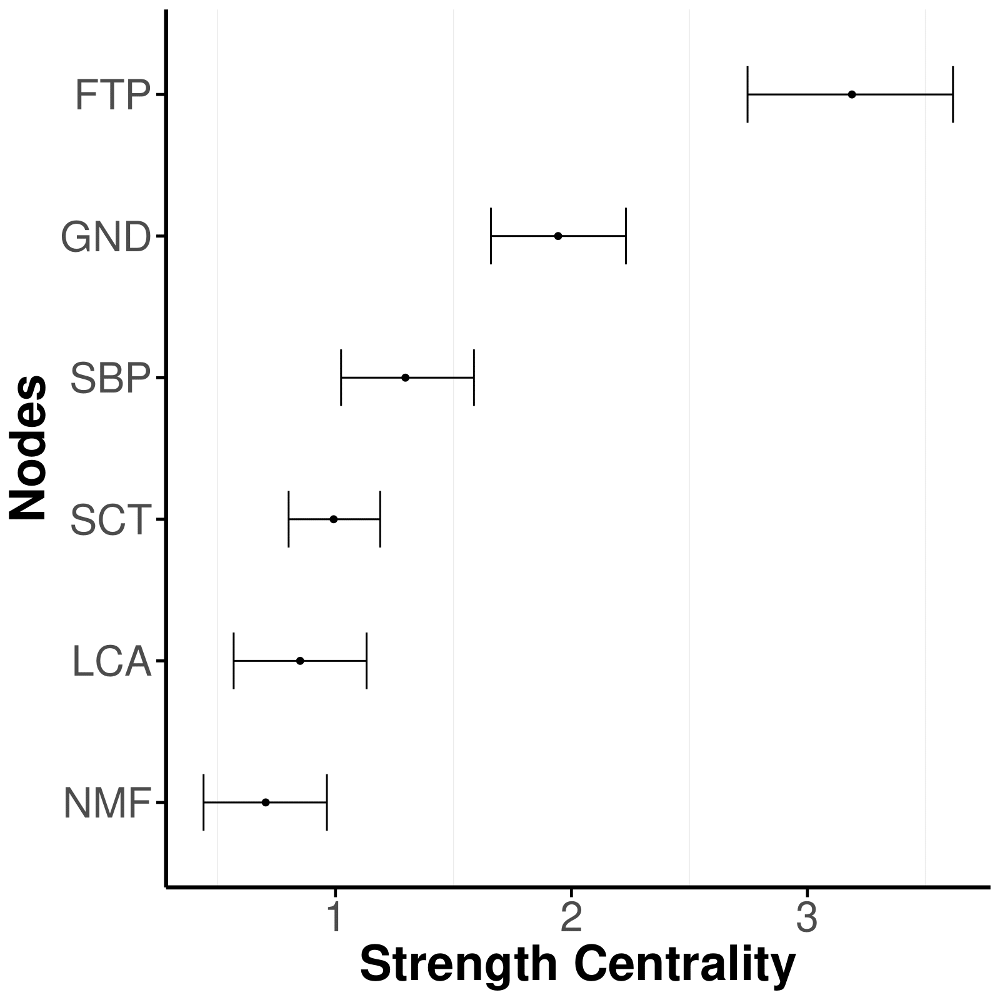

<div style="float:right; margin-right:20px; margin-bottom:20px;">


</div>

# easybgm: Easy Bayesian Graphical Modeling

The `R` package `easybgm` provides a user-friendly package for
performing a Bayesian analysis of psychometric networks. In particular,
it helps to fit, extract, and visualize the results of a Bayesian
graphical model commonly used in the social and behavioral sciences. The
package is a wrapper around existing packages. So far, the package
supports fitting and extracting results of cross-sectional network
models using `BDgraph` (Mohammadi & Wit, 2015), `BGGM`(Williams &
Mulder, 2019), and `bgms` (Marsman, van den Bergh & Haslbeck, 2025). As
output, the package extracts the posterior parameter estimates, the
posterior inclusion probability, the inclusion Bayes factor, and
optionally posterior samples of the parameters and the nodes centrality.
The package comes with an extensive suite of visualization functions.
The package now also supports comparing networks across groups. This is
done through Bayesian inference to quantify differences in conditional
(in)dependence structures, using functionality from `BGGM` (Williams et
al., 2020) and `bgms` (Marsman et al., 2025). In addition, it allows
users to incorporate clustering assumptions by specifying a stochastic
block prior on the network structure and to test hypotheses about the
presence of such clustering (Sekulovski et al., 2025) via `bgms`.

## Installation

To install this package from Github use

``` r
install.packages("remotes")
remotes::install_github("KarolineHuth/easybgm")
```

To rather install the most up-to-date developer version, use

``` r
install.packages("remotes")
remotes::install_github("KarolineHuth/easybgm", ref = "developer")
```

## Overview

### Estimation

The package consists of wrapper functions around existing R packages
(i.e., `BDgraph`, `bgms`, and `BGGM`). To initiate estimation,
researchers must specify the data set and the data type (i.e.,
continuous, mixed, ordinal, or binary). Based on the data type
specification, `easybgm` estimates the network using the appropriate R
package (i.e., `BDgraph` for continuous and mixed data, and `bgms` for
ordinal and binary data). Users can override the default package
selection by specifying their preferred R package with the `package`
argument. All other arguments, such as package-specific informed prior
specifications, can be passed to `easybgm`. As output, `easybgm` returns
the posterior parameter estimates, the posterior inclusion probability,
and the inclusion Bayes factor. In addition, the package extracts the
posterior samples of the parameters by setting `save = TRUE` and the
strength centrality samples by setting `centrality = TRUE`. When
`edge_prior = "Stochastic-Block"` is used with `bgms`, the output
additionally includes the posterior estimates of node- cluster
memberships, the posterior inclusion probabilities for all possible
numbers of clusters, and the posterior coclustering matrix which depicts
the proportion of times each pair of nodes appeared in the same cluster.

### Visualization

The package comes with an extensive suite of functions to visualize the
results of the Bayesian analysis of networks. We provide more
information on each of the plots below. The visualization functions use
`qgraph` (Epskamp et al., 2012) or `ggplot2` (Wickham, 2016) as the
backbone.

#### Edge Evidence Plot

The edge evidence plot aids researchers in deciding which edges provide
robust inferential conclusions. In the edge evidence plot, edges
represent the inclusion Bayes factor $`\text{BF}_{10}`$. Yellow edges
indicate evidence for edge absence (i.e., conditional independence),
grey edges indicate the absence of evidence, and blue edges indicate
evidence for edge presence (i.e., conditional dependence). Blue edges
represent evidence for inclusion, light blue, dashed edges represent
weak evidence for inclusion, grey edges represent absence of evidence,
light yellow, dashed edges represent some evidence for exclusion, and
dark yellow edges represent strong evidence for exclusion. By default, a
$`\text{BF}_{10} > 10`$ is considered strong evidence for inclusion and
$`\text{BF}_{01} > 10`$ for exclusion, and a $`\text{BF}_{10} > 3`$ is
considered weak evidence for inclusion and $`\text{BF}_{01} > 3`$ for
exclusion. Users can specify the threshold for Bayes factors.

#### Network Plot

In the network plot, edges indicate the strength of partial association
between two nodes. The network plot shows all edges with an inclusion
Bayes factor greater than $1$, i.e. all edges that have some evidence of
inclusion. Edge thickness and saturation represent the strength of the
association; the thicker the edge, the stronger the association. Red
edges indicate negative associations and blue edges indicate positive
associations.

#### Structure Plots

The structure uncertainty can be assessed with the posterior structure
probability plot and the posterior complexity plot. The posterior
structure probability plot shows the posterior probabilities of the
visited structures, sorted from the most to the least probable. Each dot
represents one structure. The more structures with similar posterior
probability, the more uncertain the true structure. If one structure
dominates the posterior structure probability, we can be relatively
certain about the true structure.

The posterior complexity plot shows the posterior probability of a
structure complexity (i.e., number of present edges in a network). Here,
the posterior probability of all structures with the same complexity are
aggregated into one plot.

#### 95 % Highest Density Intervals of the Posterior Parameter Distribution

The 95 % highest density intervals (HDI) of the parameters are
visualized with a parameter forest plot. In the plot, dots represent the
median of the posterior samples and the lines indicate the shortest
interval that covers 95% of the posterior distribution. The narrower an
interval, the more stable a parameter.

#### Centrality Plot

Researchers often use centrality measures to obtain aggregated
information for each node, such as the connectedness quantified by
strength centrality. Credible intervals for strength centrality can be
obtained by calculating the centrality measure for each sample of the
posterior distribution. The higher the centrality, the more connected
the node; error bars represent the 95% High Density Interval (HDI).

## Example

We want to illustrate the package use with an example. In particular, we
use the women and mathematics data which can be loaded with the package
`BGGM`. We fit the model and extract its results with the function
`easybgm`. We specify the data and the data type, which in this case is
`binary`.

``` r
library(easybgm)
library(BGGM)

data <- na.omit(women_math)
colnames(data) <- c("LCA", "GND", "SCT", "NMF", "SBP", "FTP")

res <- easybgm(data, type = "binary")
```

Having fitted the model, we can now take a look at its results.
<!-- When `edge_prior = "Stochastic-Block"`, the summary also includes clustering information, such as the estimated node memberships, the posterior probabilities for all possible numbers of clusters, and the Bayes factor comparing the hypothesis that there are two or more clusters against the null of a single cluster. Researchers can additionally use the `clusterBayesfactor` function to test hypotheses about specific numbers of clusters. -->

``` r
summary(res)

#>  BAYESIAN ANALYSIS OF NETWORKS 
#>  Model type: binary 
#>  Number of nodes: 6 
#>  Fitting Package: bgms 
#> --- 
#>  EDGE SPECIFIC OVERVIEW 
#>  Relation Estimate Posterior Incl. Prob. Inclusion BF Category
#>   LCA-GND    0.000                 0.034        0.035 excluded
#>   LCA-SCT    0.001                 0.027        0.028 excluded
#>   GND-SCT    0.003                 0.043        0.044 excluded
#>   LCA-NMF    0.001                 0.038        0.040 excluded
#>   GND-NMF    0.508                 1.000          Inf included
#>   SCT-NMF   -0.012                 0.084        0.092 excluded
#>   LCA-SBP    0.001                 0.031        0.032 excluded
#>   GND-SBP   -0.756                 1.000          Inf included
#>   SCT-SBP    0.337                 0.982       54.556 included
#>   NMF-SBP   -0.980                 1.000          Inf included
#>   LCA-FTP   -0.004                 0.051        0.054 excluded
#>   GND-FTP    0.000                 0.040        0.042 excluded
#>   SCT-FTP    1.176                 1.000          Inf included
#>   NMF-FTP    0.670                 1.000          Inf included
#>   SBP-FTP   -0.014                 0.090        0.099 excluded
#> 
#> Bayes Factors larger than 10 were considered sufficient evidence for the categorization. 
#>  --- 
#>  AGGREGATED EDGE OVERVIEW 
#>  Number of included edges: 6 
#>  Number of inconclusive edges: 0 
#>  Number of excluded edges: 9 
#>  Number of possible edges: 15 
#>  
#>  --- 
#>  STRUCTURE OVERVIEW 
#>  Number of visited structures: 109 
#>  Number of possible structures: 32768 
#>  Posterior probability of most likely structure: 0.6264 
#> ---
```

Furthermore, we can visualize the results with plots. In a first step,
we assess the edge evidence plot in which edges represent the inclusion
Bayes factor $`\text{BF}_{10}`$. In the plot, blue edges represent
evidence for inclusion (default values: $`\text{BF}_{10} > 10`$), light
blue, dashed edges represent weak evidence for inclusion
($`3 < \text{BF}_{10} < 10`$), grey edges represent absence of evidence
($`1/3 < \text{BF}_{10} < 3`$), light yellow, dashed edges represent
some evidence for exclusion ($`1/10 < \text{BF}_{10} < 1/3`$), and dark
yellow edges represent strong evidence for exclusion
($`\text{BF}_{10} < 1/10`$). Especially in a large network, it can be
useful to split the edge evidence plot in two parts by setting the
`split` argument to `TRUE`, which splits the plot into the edges with
some evidence for inclusion (i.e., $`\text{BF}_{10} > 1`$) and those
with some evidence for exclusion (i.e., $`\text{BF}_{10} < 1`$).

``` r
plot_edgeevidence(res, edge.width = 2, split = F, legend = F)
```



Furthermore, we can look at the network plot in which edges represent
the partial associations.

``` r
plot_network(res, layout = "spring", 
             layoutScale = c(.8,1), palette = "R",
             theme = "TeamFortress", vsize = 6)
```



We can also assess the structure specifically with three plots. Note
that this only works, if we use either the `BDgraph` or `bgms` package.

``` r
plot_structure_probabilities(res, as_BF = FALSE)
```



``` r
plot_complexity_probabilities(res, as_BF = FALSE)
```



``` r
plot_structure(res, layoutScale = c(.8,1), palette = "R",
               theme = "TeamFortress", vsize = 6, edge.width = .3, layout = "spring")
```



In addition we can obtain posterior samples from the posterior
distribution by setting `save = TRUE` in the `easybgm` function and
thereby open up new possibilities of assessing the model. We can extract
the posterior density of the parameters with a parameter forest plot.

``` r
res <- easybgm(data, type = "binary", save = TRUE, centrality = TRUE)
plot_parameterHDI(res)
```



Furthermore, researcher can wish to aggregate the findings of the
network model, commonly done with centrality measures. Due to the
discussion around the meaningfulness of centrality measures in
psychometric network models, we recommend users to stick to the strength
centrality. To obtain the centrality measures, users need to set
`save = TRUE` and `centrality = TRUE`, when estimating the network model
with `easybgm`. The centrality measures can be inspected with the
centrality plot.

``` r
plot_centrality(res, measures = "Strength")
```



### Comparing networks across groups

All of the functionalities mentioned above can also be used when
comparing networks across groups. The function `easybgm_compare` allows
users to compare networks across two or more groups using Bayesian
inference to extract differences in conditional (in)dependence
structures. The function supports the packages `BGGM` and `bgms`.

``` r
library(easybgm)
library(bgms)

data <- na.omit(ADHD)

group1 <- data[1:10, 1:5]
group2 <- data[11:20, 1:5]

# for two groups 
res <- easybgm_compare(list(group1, group2), 
                type = "binary", save = TRUE)

# for multiple groups


res <- easybgm_compare(data[1:200, 1:5], 
                group_indicator = rep(c(1, 2, 3, 4), each = 50),
                type = "binary", 
                save = TRUE,
                )
```

## Background Information

For more information on the package, the Bayesian background, its
application to networks and the respective plots, check out:

Huth, K., Keetelaar, S., Sekulovski, N., van den Bergh, D., & Marsman,
M. (2023). Simplifying Bayesian analysis of graphical models for the
social sciences with easybgm: A user-friendly R-package.
<https://doi.org/10.31234/osf.io/8f72p>

Huth, K., de Ron, J., Luigjes, J., Goudriaan, A., Mohammadi, R., van
Holst, R., Wagenmakers, E.J., & Marsman, M. (2023). Bayesian Analysis of
Cross-sectional Networks: A Tutorial in R and JASP. PsyArXiv
<https://doi.org/10.31234/osf.io/ub5tc>.

## Bug Reports, Feature Request, or Contributing

If you encounter any bugs or have ideas for new features, you can submit
them by creating an issue on Github. Additionally, if you want to
contribute to the development of `easybgm`, you can initiate a branch
with a pull request; we can review and discuss the proposed changes.

## References

Epskamp, S., Cramer, A. O. J., Waldorp, L. J., Schmittmann, V. D., &
Borsboom, D. (2012). qgraph: Network Visualizations of Relationships in
Psychometric Data. Journal of Statistical Software, 48 . doi:
10.18637/jss.v048.i04.

Huth, K., de Ron, J., Luigjes, J., Goudriaan, A., Mohammadi, R., van
Holst, R., Wagenmakers, E.J., & Marsman, M. (2023). Bayesian Analysis of
Cross-sectional Networks: A Tutorial in R and JASP. PsyArXiv doi:
10.31234/osf.io/ub5tc.

Marsman M, van den Bergh D, Haslbeck J.M.B. Bayesian Analysis of the
Ordinal Markov Random Field. Psychometrika. 2025;90(1):146-182. doi:
10.1017/psy.2024.

Mohammadi, Reza, and Ernst C Wit. (2015). “BDgraph: An R Package for
Bayesian Structure Learning in Graphical Models.” Journal of Statistical
Software 89 (3). doi: 10.18637/jss.v089.i03.

Sekulovski, N., Arena, G., Haslbeck, J. M. B., Huth, K., Friel, N., &
Marsman, M. (2025). A Stochastic Block Prior for Clustering in Graphical
Models. PsyArXiv doi: 10.31234/osf.io/29p3m_v1.

Wickham, H. (2016). ggplot2: Elegant graphics for data analysis.
Springer-Verlag New York. Retrixeved from
<https://ggplot2.tidyverse.org>.

Williams, Donald R, and Joris Mulder. (2019). “Bayesian Hypothesis
Testing for Gaussian Graphical Models: Conditional Independence and
Order Constraints.” PsyArXiv. doi: 10.31234/osf.io/ypxd8.

Williams DR, Rast P, Pericchi LR, Mulder J (2020). Comparing Gaussian
graphical models with the posterior predictive distribution and Bayesian
model selection. Psychological Methods. doi: 10.1037/met0000254.

<!-- badges: start -->

[](https://github.com/KarolineHuth/easybgm/actions/workflows/R-CMD-check.yaml)

<!-- badges: end -->
